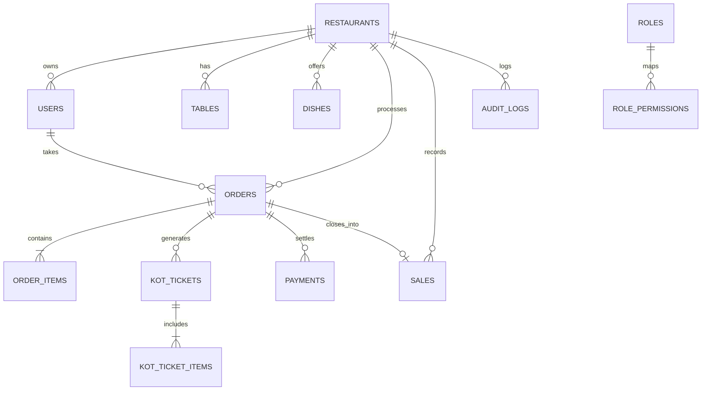

# ServeFlow Database Schema & Transaction Model

Database Engine: **PostgreSQL 17**  
Database Name: `serveflow`

---

## 1. Relational Entity Diagram (Mermaid)



---

## 2. Table Definitions

### `restaurants`
| Column | Type | Constraints | Description |
| :--- | :--- | :--- | :--- |
| `id` | VARCHAR(64) | PRIMARY KEY | Unique restaurant identifier |
| `name` | VARCHAR(255) | NOT NULL | Restaurant display name |
| `tagline` | VARCHAR(255) | | Promotional tagline |
| `address` | TEXT | | Full address |
| `phone` | VARCHAR(50) | | Restaurant contact number |
| `gstin` | VARCHAR(50) | | GST identification number |
| `fssai` | VARCHAR(50) | | FSSAI food license number |
| `upi_id` | VARCHAR(100) | | UPI QR payment ID |
| `gst_percent` | NUMERIC(5, 2) | DEFAULT 5.00 | Standard GST rate |
| `is_gst_enabled` | BOOLEAN | DEFAULT TRUE | Toggle GST computation |
| `created_at` | TIMESTAMPTZ | DEFAULT NOW() | Timestamp |

### `users`
| Column | Type | Constraints | Description |
| :--- | :--- | :--- | :--- |
| `id` | VARCHAR(64) | PRIMARY KEY | Unique user ID (`usr_...`) |
| `restaurant_id` | VARCHAR(64) | REFERENCES restaurants(id) | Tenant scope |
| `employee_id` | VARCHAR(50) | NOT NULL | e.g. `ADM-001`, `DIN-001` |
| `name` | VARCHAR(255) | NOT NULL | Employee full name |
| `email` | VARCHAR(255) | | Employee email |
| `phone` | VARCHAR(50) | | Employee mobile |
| `password_hash`| VARCHAR(255) | NOT NULL | **Argon2id** hash |
| `role` | VARCHAR(20) | CHECK (ADMIN, DINING, KITCHEN, TAKEAWAY) | Persona role |
| `status` | VARCHAR(20) | CHECK (ACTIVE, INACTIVE, SUSPENDED) | Login control |
| `last_login_at`| TIMESTAMPTZ | | Timestamp of last session |

*Unique constraint: `(restaurant_id, employee_id)`*

### `role_permissions`
| Column | Type | Description |
| :--- | :--- | :--- |
| `role` | VARCHAR(20) | ADMIN, DINING, KITCHEN, TAKEAWAY |
| `permission_name`| VARCHAR(100) | e.g. `orders.create`, `payments.verify` |

### `tables`
| Column | Type | Constraints | Description |
| :--- | :--- | :--- | :--- |
| `id` | VARCHAR(64) | PRIMARY KEY | Table identifier |
| `number` | VARCHAR(20) | NOT NULL | Table number (e.g. `01`, `05`) |
| `capacity` | INT | NOT NULL DEFAULT 4 | Seating capacity |
| `status` | VARCHAR(30) | CHECK (`available`, `occupied`, `bill_requested`, `payment_pending`) | Current floor status |
| `current_order_id`| VARCHAR(64) | | Active dining order |
| `current_total`| NUMERIC(10, 2) | DEFAULT 0.00 | Live running total |
| `active_employee_id`| VARCHAR(64) | REFERENCES users(id) | Waiter / Captain assigned |

### `orders` & `order_items`
- `orders`: Tracks lifecycle (`created`, `sent_to_kitchen`, `bill_requested`, `payment_submitted`, `closed`), customer info, subtotal, GST breakdown, grand total, and bill number.
- `order_items`: Tracks individual dishes, prices, quantities, notes, and batch IDs (`batch_id = 1` for initial, `2+` for additions).

### `kot_tickets` & `kot_ticket_items`
- `kot_tickets`: Kitchen Order Tickets dispatched to the kitchen queue (`new`, `preparing`, `ready`, `served`). `is_addition = TRUE` distinguishes re-orders.
- `kot_ticket_items`: Specific dishes and quantities for each ticket.

### `payments` & `sales`
- `payments`: Tracks payment submission (`method`, `amount`, `received_amount`, `change`, `ref_number`, `status: pending | verified`).
- `sales`: Permanent financial ledger record created atomically when payment is verified by Admin.

### `audit_logs`
- Append-only audit record tracking `LOGIN_SUCCESS`, `LOGIN_FAILED`, `EMPLOYEE_CREATED`, `EMPLOYEE_UPDATED`, `EMPLOYEE_DEACTIVATED`, `PASSWORD_RESET`, `ROLE_CHANGED`, `PAYMENT_VERIFIED`.
- Passwords and temporary credentials are cryptographically excluded from metadata.

---

## 3. ACID Transaction Guarantees

### Atomic Order Creation:
```sql
BEGIN;
  INSERT INTO orders (...);
  INSERT INTO order_items (...);
  INSERT INTO kot_tickets (...);
  INSERT INTO kot_ticket_items (...);
  UPDATE tables SET status = 'occupied', current_order_id = $1, current_total = $2 WHERE number = $3;
  INSERT INTO notifications (...);
COMMIT;
```

### Atomic Payment Verification:
```sql
BEGIN;
  UPDATE payments SET status = 'verified', verified_at = NOW(), verified_by_id = $1 WHERE order_id = $2;
  UPDATE orders SET status = 'closed', updated_at = NOW() WHERE id = $2;
  INSERT INTO sales (...) VALUES (...);
  UPDATE tables SET status = 'available', current_order_id = NULL, current_total = 0.00, active_employee_id = NULL WHERE number = $3;
  INSERT INTO audit_logs (...) VALUES (...);
COMMIT;
```
